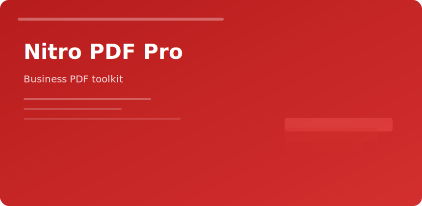

  

  

## Nitro PDF Pro

| Module | Use case |
|--------|----------|
| Edit | Fix typos without re-export from Word |
| OCR | Make scans searchable |
| Forms | Fill + flatten for records |
| Batch | Stamp, convert, combine folders |

### Office scenarios

- **Legal:** Bates numbering and redaction trails
- **Finance:** Combine statements, apply passwords
- **HR:** Form templates with consistent fields

### Quality settings

Export PDF/A when archiving; use lossless compression for line art schematics.

### Integration

Outlook and Explorer hooks reduce "print to PDF" detours. Prefer direct combine from source files to preserve text layers.

nitro pdf pro editor ocr business documents windows
